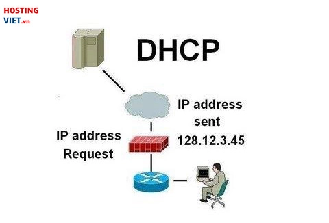
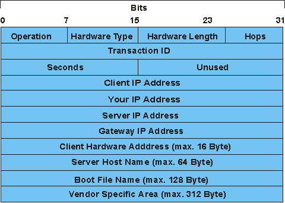

# DHCP

DHCP chính là từ viết tắt của cụm từ Dynamic Host Configuration Protocol. DHCP là giao thức có chức năng cấp phát địa chỉ IP cho tất cả các thiết bị truy cập trên cùng một mạng thông qua máy chủ DHCP được tích hợp trên router. 

DHCP cấp thông số subnet mask, default gateway và dịch vụ DNS.

# DHCP Frame
