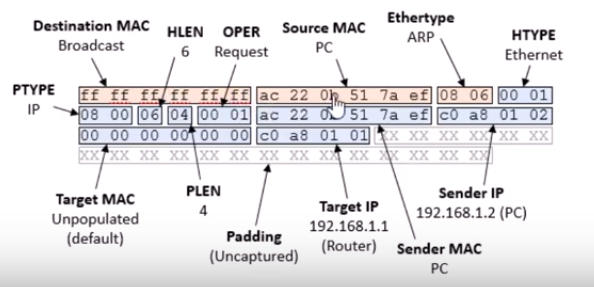

<span style="font-family: Courier New;">

# ARP




+ Destination MAC (6) : mặc định <ins>**0xFF,0xFF,0xFF,0xFF,0xFF,0xFF**</ins>

+ Source MAC PC (6) : địa chỉ nguồn, là địa chỉ của <ins>**ENC28J60**</ins>

+ Ethernet Type (2) : thể hiện đây là bản tin <ins>**ARP (0x08 0x06)**</ins>

+ Htype (2) : hardware type -  Ethernet <ins>**0x00 0x01**</ins> 

+ Ptype (2) : protocol type - IP <ins>**0x00 0x01**</ins> 

+ HLEN (2) : hardware length <ins>**0x06**</ins>

+ PLEN (2) : protocol length <ins>**0x04**</ins>

+ OPRE Request (2) : request <ins>**0x00 và 0x01**</ins>, reply <ins>**0x00 và 0x02**</ins>

+ Sender MAC PC (6) : địa chỉ MAC của ENC28J60

+ Sender IP (4) : địa chỉ của ENC28J60

+ Target MAC (6) : mặc định là <ins>**0x00,0x00,0x00,0x00,0x00,0x00**</ins>

+ Target IP (4) : địa chỉ của PC

# Get mac


Địa chỉ trùng với địa chỉ MAC và IP của cài đặt. PC đã lấy được địa của MAC và IP của ENC28J60

# Struct

```c
typedef struct
{
	uint8_t MAC_dest[6];             		// MAC destination
	uint8_t MAC_source[6];                  // MAC source
	uint16_t Ethernet_type;                 // Ethernet type
	uint16_t Hardwave_type;                 // Hardwave type
	uint16_t Protocol_type;                 // Protocol type (ARP)
	uint16_t Size;                          // Size
	uint16_t Opcode;                        // Opcode
	uint8_t MAC_sender[6];                  // Sender MAC
	uint8_t IP_sender[4];                   // Sender IP
	uint8_t MAC_target[6];                  // Target MAC
	uint8_t IP_target[4];                   // Target IP
}ARP_Struct;
```

# 2. ICMP


```c
u16 base_checksum(u08 *data, u16 len){
	u32 cs = 0;
	while(len>1){
		cs += (u16) (((u32)*data<<8)|*(data+1));
		data+=2;
		len-=2;
	}
	if (len){
		cs += (0xFF & *data)<<8;
	}
	while (cs>>16){
		cs= ((u16)cs+(cs>>16));
	}
	cs=~cs;
	return swap16((u16) cs);
}
```
Checksum bao gồm:
+ IPV4
+ ICMP
```c
icmp_struct.CheckSum = ipv4_checksum((u08 *)&icmp_struct.Header_length, IPV4_SIZE);
// icmp_struct.CheckSum = ipv4_checksum((u08 *)&icmp_struct.Header_length, 20);
```
Checksum ipv4 được tính từ Header_length và có độ dài là 20 - đây là chiều dài của giao
thức IPV4
```c
icmp_struct.ICMP_Checksum = icmp_checksum((u08*)&(icmp_struct.ICMP_Type), ICMP_SIZE+ len-IPV4_ICMP_SIZE);
// icmp_struct.CheckSum = ipv4_checksum((u08 *)&icmp_struct.Header_length, 8+ len - 42);
```
Checksum icmp được tính từ ICMP_REPY đó là điểm bắt đầu của ICMP trong giao thức (có index là 34).
Độ dài của giao thức ICMP bao gồm các byte cấu hình (8 byte) và byte dữ liệu
+ ***len*** : tổng chiều dài của package
```sh
len of icmp = SUM (len) - bắt đầu icmp (34)
```
# 3. UDP


```c
/* 
element of udp data
	0xc0ff, 0xff32, // c0 ff ff 32 => Source IP Address : 192.255.255.50
	0xc0ff, 0xff33, // c0 ff ff 33 => Destination IP Address : 192.255.255.51
	0x0011,         // Zero(0x00), Protocol(0x11)
	0x000c,         // UDP Length
	// UDP Header
	0xa45c,         // a4 5c => Source Port : 0xa45c = 42076
	0x270f,         // 27 0f => Destination Port : 0x270f = 9999
	0x000c,         // UDP Length
	0x7465, 0x7374  // 74 65 73 74 => "test"

	UDP Length : duoc cong 2 lan
	0x0011 : Protocol(0x11) la thanh phan ben ngoai

	len: tinh tu source IP
	-> len of udp : len - 8
	0x11  : Protocol(0x11) la thanh phan ben ngoai
	u32 cs = 0x11 + len - 8;

*/

extern u16 udp_checksum(u08 *data, u16 len){
	u32 cs = 0x11 + len - 8;
	while(len>1){
		cs += (u16) (((u32)*data<<8)|*(data+1));
		data+=2;
		len-=2;
	}
	if (len){
		cs += (0xFF & *data)<<8;
	}
	while (cs>>16){
		cs = ((u16)cs+(cs>>16));
	}
	cs=~cs;
	return swap16((u16)cs);
}

udp_struct.UDP_Checksum = 0x0000;
udp_struct.UDP_Checksum = udp_checksum((u08*)udp_struct.SourceIP, UDP_SIZE + len_of_data + 8);
```

Check sum bao gồm:

+ Source IP
+ Destination IP
+ Protocol (u16 - 0x0011)
+ UDP length (u16)
+ Source Port
+ Destination Port
+ UDP length (u16)
+ Data

***len*** của checksum tính từ Source IP đến hết phần dữ liệu

Ta có thể tính từ udp_struct.SourceIP, nhưng phải công thêm  ***Protocol (u16 - 0x0011), UDP length (u16).***
Đối với hàm udp_checksum thì tham số ***len*** phải công thêm ***8*** vì có thêm ***Source IP, Destination IP***

Tuy nhiên len - 8 là UDP length (2 thành phần ***Source IP, Destination IP*** không nằm trong giao thức UDP)
nên.
```c
u32 cs = 0x11 + len - 8;
```

</span>