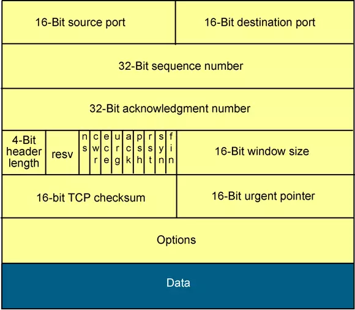
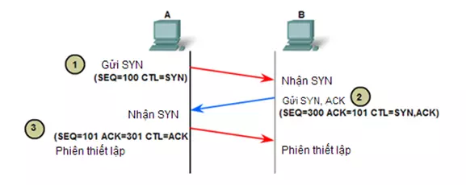
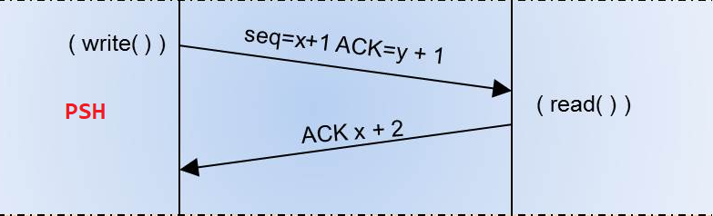
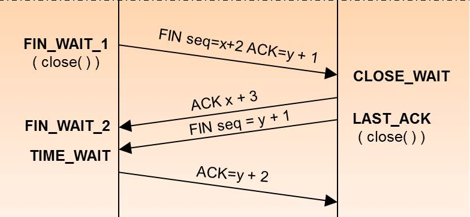

<span style="font-family: Courier New;">

# TCP Frame


Trong Project ENC28J60 đóng vai trò là master, còn PC là client

# Tcp Operation

## 1. TCP 3 way handshaking



Đầu tiên khi PC kết nối đến ENC28J60 sẽ *** bắt tay ***. 

 + 1: PC-SYN -> ENC28J60
 + 2: ENC28J60- ACK-> PC, ENC28J60- FIN||ACK-> PC
 + 3: PC (ACK)-> ENC28J60

## 2. TX



## 3. End



## 4. Check sum

Check sum bao gồm:

+ Source IP
+ Destination IP
+ Protocol (u16 - 0x0011)
+ UDP length (u16)
+ Source Port
+ Destination Port
+ UDP length (u16)
+ Data


```c
extern u16 tcp_checksum(u08 *data, u16 len){
	u32 cs = 0x06 + len - 8;
	while(len>1){
		cs += (u16) (((u32)*data<<8)|*(data+1));
		data+=2;
		len-=2;
	}
	if (len){
		cs += (0xFF & *data)<<8;
	}
	while (cs>>16){
		cs = ((u16)cs+(cs>>16));
	}
	cs=~cs;
	return swap16((u16)cs);
}

tcp_struct.TCP_Checksums = tcp_checksum((u08*)tcp_struct.SourceIP, total_len - 20 +8);
```
+ total_len : IPv4 + tcp + len of data
+ -20 : len of IPv4
+ +8 : Source IP, Destination IP]

</span>