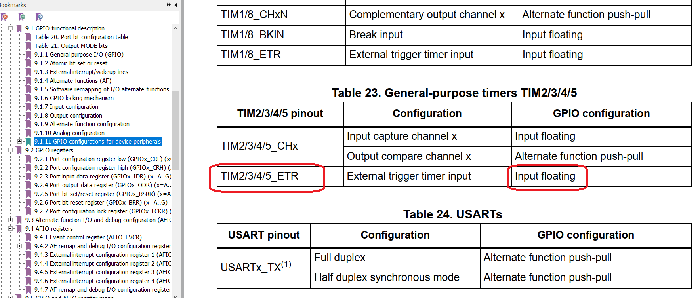
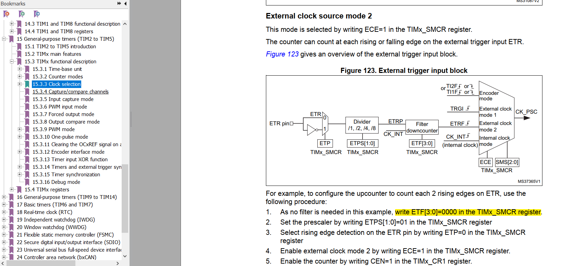
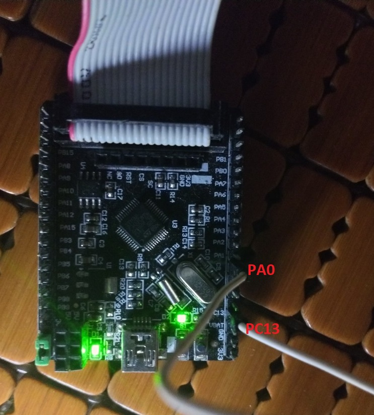
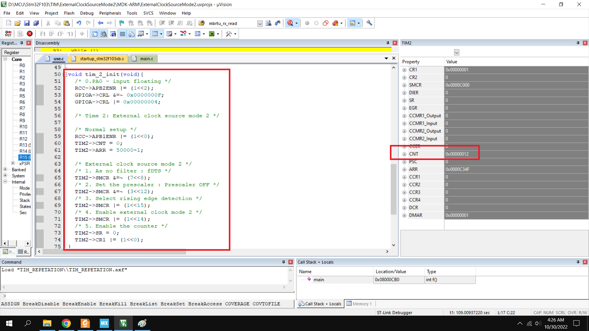

<span style="font-family: Courier New">

# TIM External clock source mode 2

## Config






## Setup board



Using the timer 1 which create pulse for time 2. Conncect the PC13 to PA0

```sh
	PC13 (Led) - PA0
```

## Setup code

```c
void tim_2_init(void){
	/* 0.PA0 - input floating */
	RCC->APB2ENR |= (1<<2);
	GPIOA->CRL &=~ 0x0000000F;
	GPIOA->CRL |= 0x00000004;
	
	/* Time 2: External clock source mode 2 */
	
	/* Normal setup */
	RCC->APB1ENR |= (1<<0);
	TIM2->CNT = 0;
	TIM2->ARR = 50000-1;
	
	/* External clock source mode 2 */
	/* 1. As no filter : fDTS */
	TIM2->SMCR &=~ (7<<8);
	/* 2. Set the prescaler : Prescaler OFF */
	TIM2->SMCR &=~ (3<<12);
	/* 3. Select rising edge detection */
	TIM2->SMCR |= (1<<15);
	/* 4. Enable external clock mode 2 */
	TIM2->SMCR |= (1<<14);
	/* 5. Enable the counter */
	TIM2->SR = 0;
	TIM2->CR1 |= (1<<0);
}
```

## Result



</span>