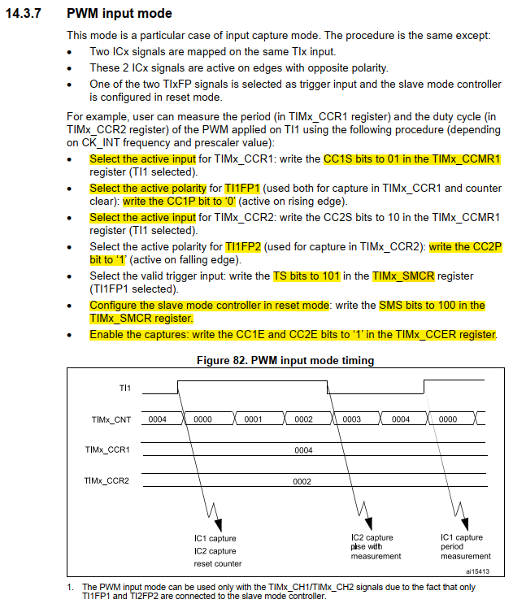
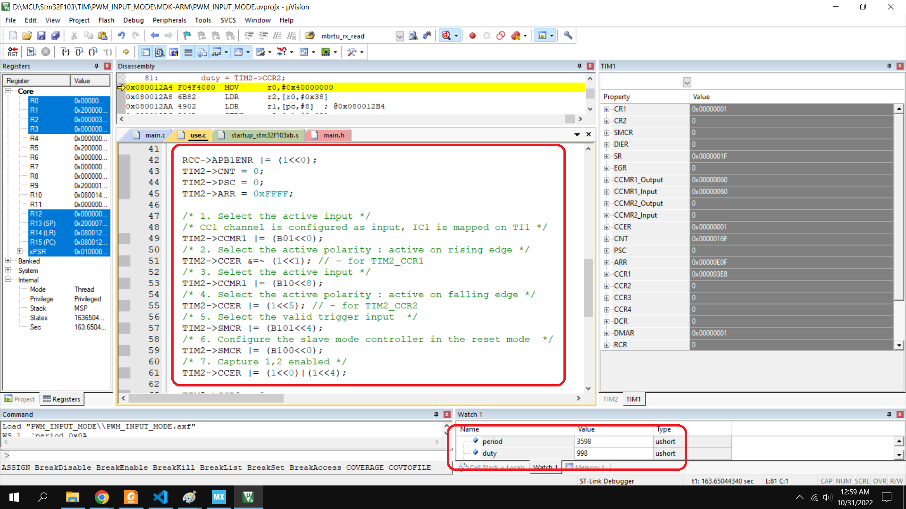

<span style="font-family: Courier New">

# PWM INPUT MODE

Using the tim 1 create the PWM pulse in PA8. The tim 2 use to calculate the frequency of pulse by the pwm input mode (PA0)




```c
void tim2_pwm_input_mode(void){
	/* 0.PA0 - input floating */
	RCC->APB2ENR |= (1<<2);
	GPIOA->CRL &=~ 0x0000000F;
	GPIOA->CRL |= 0x00000004;
	
	RCC->APB1ENR |= (1<<0);
	TIM2->CNT = 0;
	TIM2->PSC = 0;
	TIM2->ARR = 0xFFFF;

	/* 1. Select the active input */
	/* CC1 channel is configured as input, IC1 is mapped on TI1 */
	TIM2->CCMR1 |= (B01<<0);
	/* 2. Select the active polarity : active on rising edge */
	TIM2->CCER &=~ (1<<1); // - for TIM2_CCR1
	/* 3. Select the active input */
	TIM2->CCMR1 |= (B10<<8);
	/* 4. Select the active polarity : active on falling edge */
	TIM2->CCER |= (1<<5); // - for TIM2_CCR2
	/* 5. Select the valid trigger input  */
	TIM2->SMCR |= (B101<<4);
	/* 6. Configure the slave mode controller in the reset mode  */
	TIM2->SMCR |= (B100<<0);
	/* 7. Capture 1,2 enabled */
	TIM2->CCER |= (1<<0)|(1<<4);
	
	TIM2->CCR1 = 0;
	TIM2->CCR2 = 0;
	TIM2->CR1 |= (1<<0);
}
```
</span>