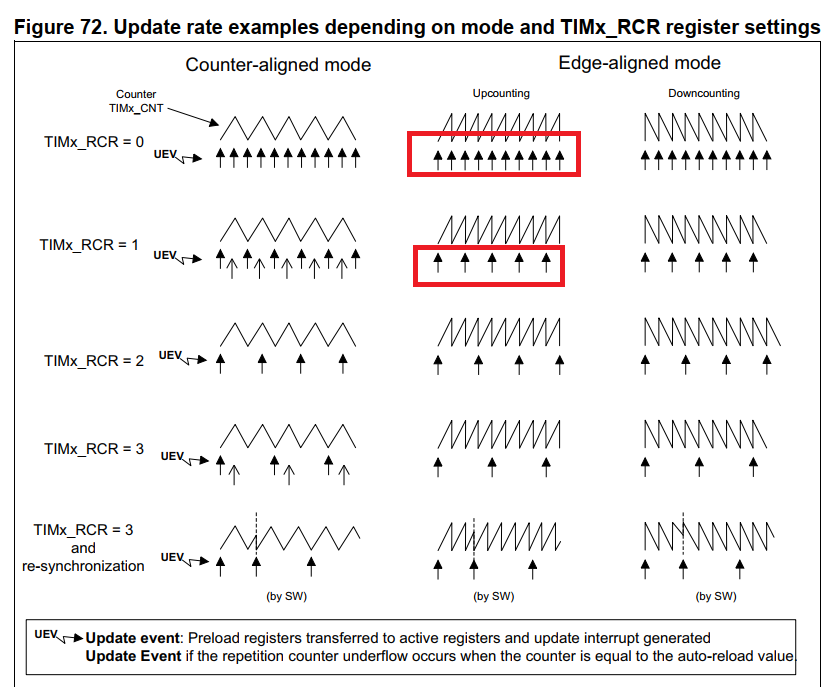
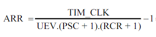
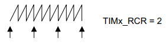

<span style="font-family: Courier New">

# TIM Repetation



```c
	TIM1->CNT = 0;
	TIM1->PSC = 720-1;
	TIM1->ARR = 50000-1;
	/* 2. Repetation */
	TIM1->RCR = 8;
```

Create a time to flash led in 4s

Formula: 



with: UEV = 4s (the time of the led)

```c
void TIM1_UP_IRQHandler(void)
{
	if (TIM1->SR & (1<<0))
	{
		LED_TOGGLE();
	}
	TIM1->SR &=~ (1<<0);
}
```
